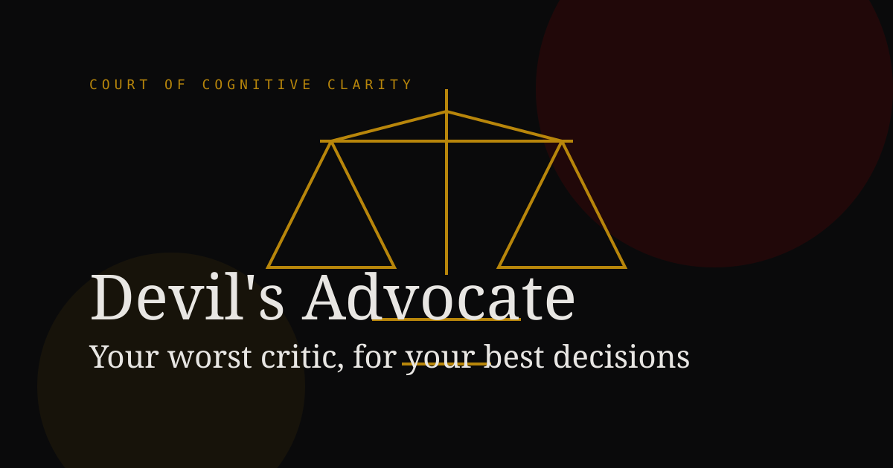
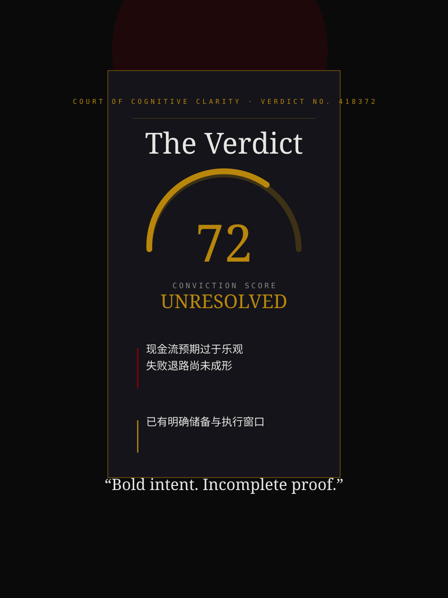
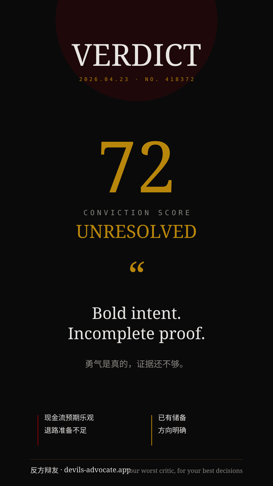
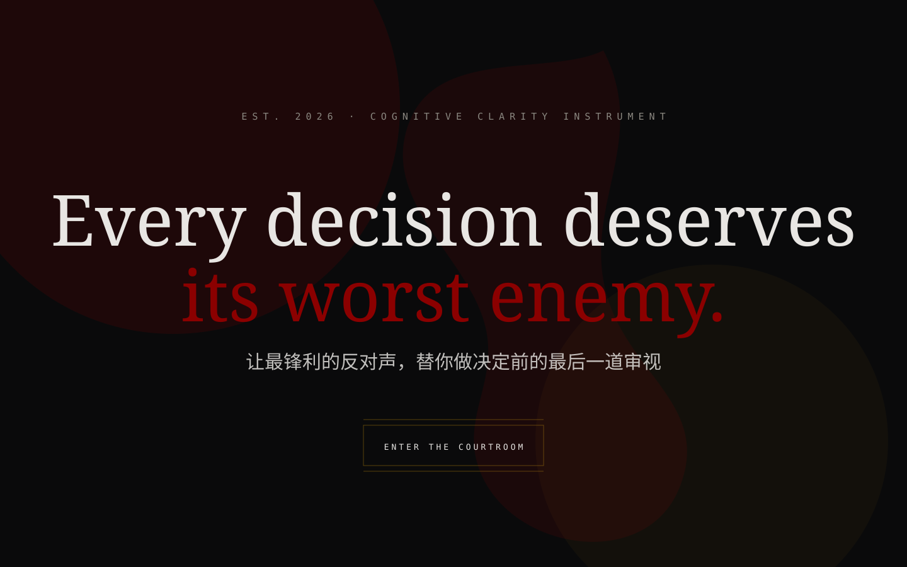

# Devil's Advocate | 反方辩友



[](./LICENSE)


[](https://vercel.com/new)

**Your worst critic, for your best decisions.**

Devil's Advocate is an AI-native decision courtroom.
You bring a decision. The product brings resistance: doubt, consequence, responsibility, regret, evidence, and the uncomfortable questions most people avoid asking.

It is not designed to comfort you quickly.
It is designed to pressure-test whether a decision deserves to survive contact with reality.

## Product Idea

Most decision tools help users clarify what they want.
This one helps users discover whether what they want can withstand opposition.

The product wraps LLM reasoning in theatrical, structured interfaces:

- **Single Blade** for direct one-on-one cross-examination
- **Five Furies** for a five-personality jury assault
- **The Courtroom** for a fully staged judicial proceeding

## Features

| Feature | Description |
| --- | --- |
| Single Blade | One AI opponent challenges the user's decision in multiple rounds. |
| Five Furies | Five distinct personas attack the same decision from five different emotional and logical angles. |
| The Courtroom | Judge, prosecution, defense, and user conduct a stylized courtroom exchange. |
| Hybrid Verdict Engine | Static layout + local content libraries + fast-model LLM refinement for much faster verdict generation. |
| Shareable Verdict Images | Export polished portrait, square, and landscape verdict images for social sharing. |
| History Archive | Local IndexedDB archive with search, filter, replay, export, and delete. |
| Settings & Data Control | API configuration, sound toggles, onboarding, import/export, and local data management. |

## Modes

### 1. Single Blade


The cleanest form of opposition.
One merciless advocate challenges your logic until your decision either sharpens or collapses.

### 2. Five Furies


Five personas rotate through the same decision:
responsibility, hindsight, intimacy, idealism, and malice.
The result becomes a jury-style deliberation report.

### 3. The Courtroom


The most theatrical mode.
A judge presides, prosecution attacks, defense responds, and the user is forced to answer in procedural form.

## Architecture

All three modes now share the same verdict-generation philosophy:

```text
statement + dialogue
-> local compression
-> fast quick-judgment request
-> local templates / libraries assemble the main verdict instantly
-> optional LLM enhancement blocks stream or fade in later
-> html2canvas export for shareable images
```

### Shared modules

- `src/lib/verdict/compress.ts`
- `src/lib/verdict/classifier.ts`
- `src/lib/llm/client.ts`
- `src/components/verdict/FlawsAndPillars.tsx`
- `src/lib/verdict/questionSummary.ts`

### Mode-specific assets

- **Single Blade**: quote library + verdict templates
- **Five Furies**: jury remarks + local role scoring + furies template
- **Courtroom**: judicial sentence templates + court scoring breakdown

## Prompt Engineering Notes

The core design principle is not “make the model say more.”
It is “make the model say only the part that truly matters.”

Three prompt-engineering choices shape the product:

1. **Role-constrained prompting**
   Each mode uses tightly framed voices instead of a generic assistant tone.

2. **Generation load shedding**
   The UI, ritual language, scoring structure, and fallback copy are prepared locally first.
   The model fills only the last, highest-value gap.

3. **Progressive enhancement**
   A usable verdict appears quickly, while richer analysis arrives independently.
   This preserves drama without forcing the user to wait on a single giant JSON response.

That trade-off sacrifices some open-ended generation in exchange for far better speed, controllability, and UX reliability.

## Tech Stack

- Next.js 14 (App Router)
- TypeScript
- Tailwind CSS
- Framer Motion
- Zustand
- IndexedDB via `idb`
- html2canvas
- Vercel

## Local Development

```bash
npm install
npm run dev
```

Then open [http://localhost:3000](http://localhost:3000).

## Deployment

### Tencent Cloud (Recommended for mainland China)

For stable mainland China access, the recommended path is:

- Tencent Cloud Lighthouse
- Ubuntu 22.04
- Node.js 20
- PM2
- Nginx reverse proxy

The repo already includes:

- [`ecosystem.config.cjs`](./ecosystem.config.cjs)
- [`deploy/nginx/devils-advocate.conf`](./deploy/nginx/devils-advocate.conf)
- [`docs/DEPLOY_TENCENT.md`](./docs/DEPLOY_TENCENT.md)

Quick path:

1. Create a Tencent Cloud Lighthouse server
2. Clone the repo onto the server
3. Fill `.env.production`
4. Run `npm install && npm run build`
5. Start with `pm2 start ecosystem.config.cjs`
6. Configure Nginx and HTTPS

### Vercel

Vercel is still useful for preview deployments and overseas demos:

1. Import the repo into Vercel
2. Keep the framework preset as `Next.js`
3. Add optional variables from `.env.example`
4. Deploy

### Suggested domains

- `devilsadvocate.app`
- `devils-advocate.app`
- `fanfangbianyou.com`

## Environment Variables

Most model traffic currently runs from the client, but these are reserved for future server-side routing and branding:

```bash
NEXT_PUBLIC_APP_URL=
NEXT_PUBLIC_BRAND_NAME=Devil's Advocate
NEXT_PUBLIC_DEFAULT_PROVIDER=deepseek
NEXT_PUBLIC_ENABLE_HOSTED_DEEPSEEK=true
DEEPSEEK_API_KEY=
HOSTNAME=0.0.0.0
PORT=3000
```

## How To Use It Well

- Describe the decision, not just the conclusion.
- Include constraints, costs, trade-offs, and what you already know.
- If you hide the hardest fact, the verdict becomes less useful.
- Use Single Blade for clarity, Five Furies for perspective spread, and The Courtroom for formal pressure testing.

## Roadmap

- [ ] Real OG screenshots to replace placeholders
- [ ] Multi-language support
- [ ] Server-side proxy and account system
- [ ] Team / collaborative decision rooms
- [ ] Stronger persona memory
- [ ] QR-enabled social landing pages
- [ ] More export themes and animated verdict cards

## Contributing

Contributions are welcome.

Suggested flow:

1. Fork the repo
2. Create a feature branch
3. Keep commit messages clear and intentional
4. Open a PR with screenshots or a short demo when UI changes are involved

## Inspiration

- Courtroom films and legal drama staging
- Classical rhetoric and adversarial questioning
- The feeling of asking yourself, honestly: “What if I am wrong?”

## Assets

See [docs/ASSETS.md](./docs/ASSETS.md) for the visual asset checklist, sizes, prompts, and placement paths.

## License

MIT
